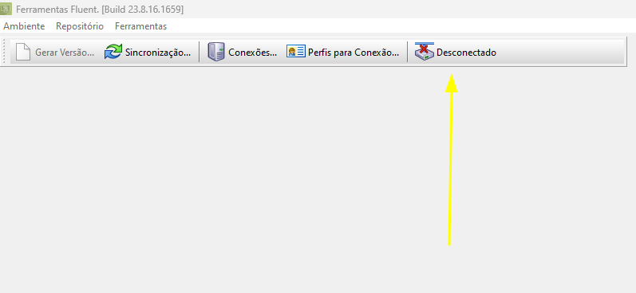
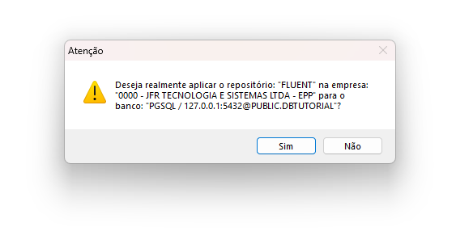
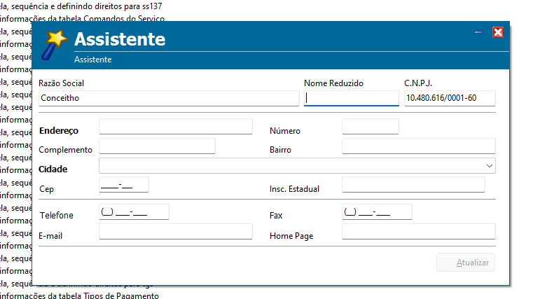

# Fluent Infra

Projeto para desenvolvimento da infraestrutura base do Fluent ERP

Este projeto compõe as infraestrutura do sistema Fluent ERP sendo utilizado como componente de comunicação entre o Fluent ERP e o mundo externo.

Detalhes Técnicos

## Estrutura de diretórios do Fluent

Recomendamos que a estrutura de diretórios do ambiente Fluent ERP seja organizado como segue:

| Diretórios | Descrição |
| ------ | ------ |
| Fluent | Raíz do projeto |
| Fluent/Application | Ambiente de produção |
| Fluent/Application/System/Lib32 | Bibliotecas 32bits |
| Fluent/Application/System/Lib64 | Bibliotecas 64bits |

## Lista de Bibliotecas

A seguir estão descritas as bibliotecas necessárias para execução do programa agrupadas por função

### Conexão com o banco de dados PostgreSQL

| Biblioteca | Versão | Path Relativo |
| ---- | --- | --- |
| libcrypto-1_1.dll | 1.1.1.3 | System\Lib32 |
| libiconv-2.dll | 1.14.0.0 | System\Lib32 |
| libintl-8.dll | 0.19.0.0 | System\Lib32 |
| libpq.dll | 10.0.10.19261 | System\Lib32 |
| libssl-1_1.dll | 1.1.1.3 | System\Lib32 |

### Criptografia SSL

| Biblioteca | Versão | Path Relativo |
| ---- | --- | --- |
| libeay32.dll | 1.0.2.19 | Win32 |
| ssleay32.dll | 1.0.2.19 | Win32 |
| libiconv.dll | 1.14.0.0 | Win32 |
| libiconv-2.dll | 1.14.0.0 | Win32 |
| libxml2.dll |  | Win32 |

### SAT Elgin Linker II / Smart SAT

| Biblioteca | Versão | Path Relativo |
| ---- | --- | --- |
| sat_elgin.dll | 5.0.2.0 | System\Lib32 |
| zlib.dll | 1.2.3.0 | System\Lib32 |

*Renomear arquivo dllsat.dll para sat_elgin.dll*

### SAT DIMEP D-SAT 2.0

| Biblioteca | Versão | Path Relativo |
| ---- | --- | --- |
| sat_dimep.dll | 4.6.1.0 | System\Lib32 |

*Renomear arquivo dllsat.dll para sat_dimep.dll*

### SAT Bematech

| Biblioteca | Versão | Path Relativo |
| ---- | --- | --- |
| sat_bematech.dll | 1.0.2.35 | System\Lib32 |

*Renomear arquivo dllsat.dll para sat_bematech.dll*
*Para que este SAT funcione é necessário copiar o arquivo bemasat.xml na pasta de sistema do Windows.*
-  *Windows 32 bits = C:\Windows\System32*
-  *Windows 64 bits = C:\Windows\SysWOW64*

Instalação Fluent

#
- Criar Grupo de usuários, no caso para o fluent o mc_tupi. Para isso é necessário acessar o bando de dados via Prompt [Veja Aqui](#https://pt.stackoverflow.com/questions/57263/como-ter-acesso-ao-consoles-do-postgresql) , uma vez dentro do psql postgres=#

    

    Execute:

  ~~~postgres
      create role mc_tupi superuser createdb createrole nologin connection limit -1;
  ~~~
      Saída terminal:
      postgres=#  create role mc_tupi superuser createdb createrole nologin connection limit -1;
      CREATE ROLE 

  ~~~postgres
      create database  dbtutorial with owner mc_tupi;
  ~~~
      Saída terminal: 
      postgres=# create database  dbtutorial with owner mc_tupi;
      CREATE DATABASE
- Crucial 
- - certifique-se de ja existir uma versão, caso não tenha ela pode ser criada se você tiver conexão com bando de dados "fluent", você pode ver e alterar onde será salva a versão utilizando o utils.exe - .

- - certifique-se que chave "Fluent\System\key.psw" do sistema esta correta, são 2 opções.

- - chave de desenvolvimento "c0002.psw" (https://fluent.conceitho.com/keys/c0002.psw) 
- - chave de oficial do cliente  "NomeChaveoficial.psw" (https://fluent.conceitho.com/keys/) 
- Com a chave correta  abra o Utils "Fluent\Win32\Utils.exe", selecione a conexão criada nos passos anteriores
- Clica em "Perfis para Conexão", clica em "+" Preencha o numero do perfil que não estiver em uso, uma descrição, (ex: Desenvolvimento), escolha a empresa 0000 - jfr Tecnologia E Sistemas Ltda - epp, selecione a conexão com banco de dados "fluent", onde dicionário(crucial para funcionar), clique em aplicar.
- Selecione a conexão pgsql fluent
- Configurar as conexões para primeira instalação e execuçãodo Fluent.
- - Na raiz do programa "\Fluent\Win32" Existe um binário  Utils.exe, execute ele.
- - - Em casos que não existe conexão criada anteriormente, vai apresentar erros por não encontrar configurações de perfil, clieque em ok até abrir.
- - - Em caso de haver uma outra conexão existente, clique em "Selecionar".
- - Conexões
- - Nova Conexão (Esse passo precisar fazer 2 vezes, uma para conexão com banco de dados da conceitho: 'fluent' e outra para o banco que foi criado anteriormente)
- - No campo  "servidor", insira o endereço do servidor.
- - No campo  "Banco de Dados", coloque o nome do bando de dados criado anteriormente.
- - No campo senha coloque a senha do banco de dados
- -  Clique em Salvar
- - Agora clique bom botão direito do mouse sobre a conexão criada, em seguida "Testar Conexão", Saída esperada:
      
         Conexão com êxito. Tempo para conexão 00:00:036
        -> Host: 127.0.0.1:5432.
        -> Servidor:  dbtutorial:postgres.
- - Após "Conexão com êxito".
- - Feche o utils e abra de novo.
- - Com Utils aberto, escolha a conexão com banco de dados "fluent" clicando em conexões/desconectado.

- - - Confirme se as configurações de diretório estão corretas clicando em "ambiente>configurações". 
- - - - Ex.:  
- - Agora crie  perfils de conexão, 1 perfil para puxar a versão atual do banco de dados modelo "fluent" e outra para a base onde quer aplicar o modelo do fluent.
 - - - Clique em Perfil e preencha os campos até ficar assim: 
        
        Repita o passo para o proximo perfil da nova empresa/conexão, nessa exemplo fiz assim:
        
- - Atualize a pasta dev  local "\fluent\dev" baixando do  [GitLab - Fluent Desktop](#https://gitlab.conceitho.com/fluent/fluent-desktop/-/tree/develop/Dev?ref_type=heads) toda a pasta.

Sincronização e Propagação do banco de dados.

- Clique em "Gerar Versão..." para gerar uma versão do dicionário de distribuição.
- Selecione o perfil Criado  "Desenvolvimento(perfil conectado com banco "fluent")" e clique em criar. 
- ATENÇÃO: Essa parte devemos tomar extremo cuidado pois um passo errado pode causar danos irreversíveis  no banco de dados. Na seleção "Perfil" é o banco de dados o qual vai receber as alterações de versão, Na seleção "Repositório Base" você deve selecionar a versão do dicionário criada anteriormente.
- - 
- Com o "Perfil"(onde sera aplicado a troca) e "Repositório Base(de onde vem o dicionário)" Selecionados corretamente: 
- - - Se estiver correto, clique em sim!
- - - 
- - Marque a opção troca de dicionário e clique em sincronizar e aguarde o longo processo, o  Utils pode parar de responder ou aparentar travado, porém o processo ainda ocorre no banco de dados, então aguarde pois mesmo máquinas mais potentes ainda levam 20 minutos para processar.

- - No meio do processo, irá pedir os dados da empresa, preencha corretamente. 
- - 
- - Caso o Utils pare de responder ou trave, não finalize, ele ainda esta processando no banco de dados, é bem comum acontecer isso nessa etapa do processo: 

- - Apos a troca finalizar, irá aparecer alguns erros devido algumas visões que ainda não existiam, então agora DESMARQUE a opção "Troca de Dicionário" e clique em sincronizar e repita o processo 2 vezes. 
- - - Veja:  
- - - -  1- 
- - - -  2- 
- - Sicronização finalizada, verá essa tela. 
        
    Clique em cancelar
- Agora Feche o Utils.exe e abra o Fluent "C:\Fluent\Win32\Fluent.exe" e escolha a conexão com banco que foi propagado.

